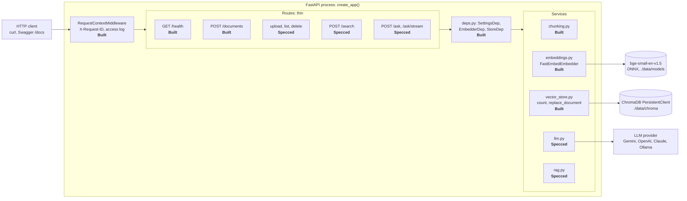
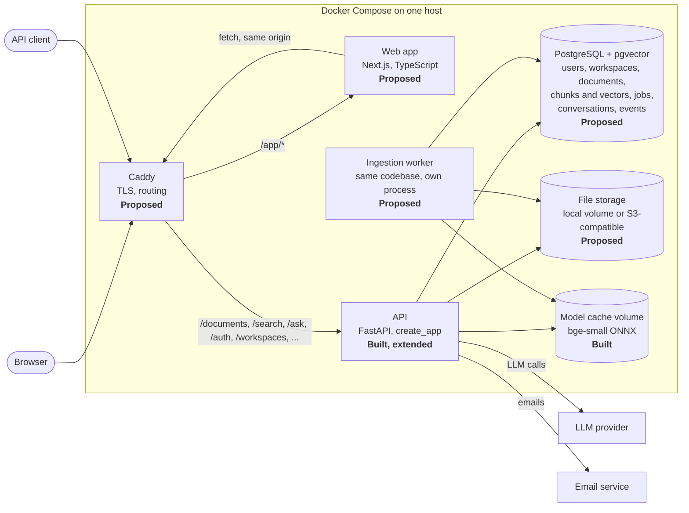
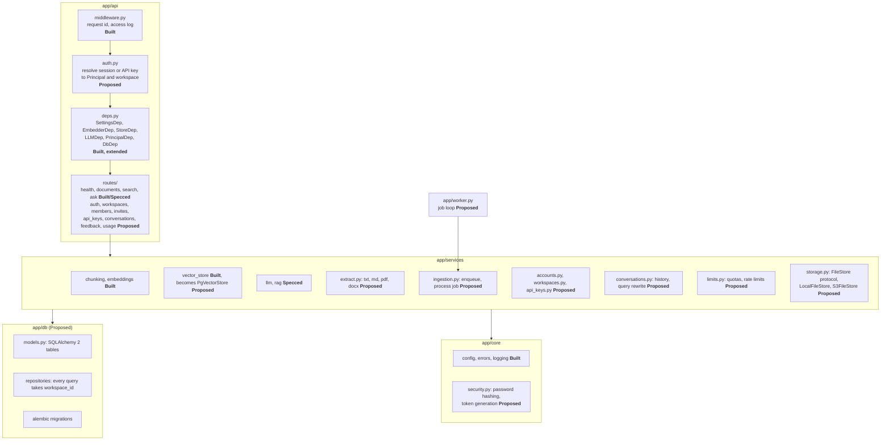
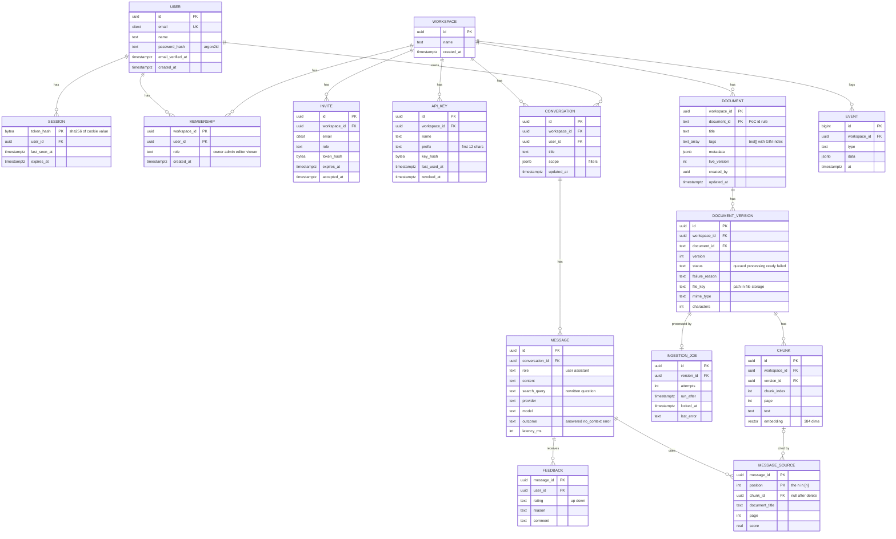
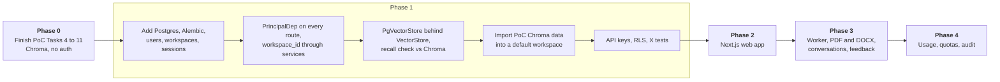

# Architecture: Sourcely

This document describes the system **as it is now** (verified against the code on 2026-09-18) and the **target** system that the [PRD](PRD.md) needs. Every component carries a status: **Built**, **Specced** or **Proposed** (see [README](README.md#status-labels-used-everywhere)).

Operation-by-operation sequences are in [`FLOW_DIAGRAMS.md`](FLOW_DIAGRAMS.md).

## Contents

1. [Current system (PoC)](#1-current-system-poc)
2. [Target system context](#2-target-system-context)
3. [Target containers](#3-target-containers)
4. [API components](#4-api-components)
5. [Data model](#5-data-model)
6. [API surface](#6-api-surface)
7. [Tenancy and security](#7-tenancy-and-security)
8. [Key decisions](#8-key-decisions)
9. [Deployment](#9-deployment)
10. [Observability](#10-observability)
11. [Scaling limits and next steps](#11-scaling-limits-and-next-steps)
12. [Migration path from the PoC](#12-migration-path-from-the-poc)

---

## 1. Current system (PoC)

One FastAPI process. Embeddings are computed in-process, and vectors live in an embedded ChromaDB on local disk. The LLM is an external API chosen in `.env`.



**What's true of the PoC and stays true in the target:**

- Layered layout: routes validate and delegate, services hold logic, services never import from `app.api`.
- Components are built once in the lifespan hook and injected through `app.state` and `Depends()`, so tests swap in fakes.
- Route handlers are plain `def`, because fastembed, Chroma and the SDKs block. FastAPI runs them in its threadpool.
- `create_app()` factory with no module-level app.
- Re-ingest replaces a document, and embedding happens before the store is touched.
- The no-relevant-context path never calls the LLM.
- Streaming fetches the first token before sending headers, so early errors keep real HTTP statuses.

## 2. Target system context

```mermaid
flowchart TB
    asker(["Asker, Curator, Admin<br/>web browser"])
    integrator(["Integrator<br/>own tools"])
    sourcely["<b>Sourcely</b><br/>web app, API, worker"]
    llm["LLM provider<br/>OpenAI-compatible or Anthropic"]
    email["Email service<br/>SMTP or transactional API"]

    asker -- "HTTPS, session cookie" --> sourcely
    integrator -- "HTTPS, Bearer API key" --> sourcely
    sourcely -- "prompts with retrieved passages" --> llm
    sourcely -- "verification, reset, invites" --> email
```



Only two things leave the deployment: prompts to the LLM provider (question plus retrieved passages) and emails. Documents, embeddings and vectors stay on the deployment's own disks.

## 3. Target containers



| Container | Responsibility | Why it's separate |
|---|---|---|
| **Caddy** | TLS, one origin for web and API, request size limits | Same origin means first-party cookies and no CORS. Same pattern as `job-tracker`. |
| **Web app** | Screens in [`WIREFRAMES.md`](WIREFRAMES.md). Server components for pages, client components for Ask streaming. | UI work and releases independent of the API. |
| **API** | Every HTTP endpoint. Query embeddings, retrieval, LLM calls, streaming. Stateless, so it can run several copies. | Already exists. |
| **Worker** | Picks ingestion jobs, extracts text, chunks, embeds, writes vectors. | PDF extraction and batch embedding take seconds to minutes. They must not tie up API threads. |
| **PostgreSQL + pgvector** | All state, including vectors (decision [D3](#d3-vector-store-once-a-worker-exists)). | One system to back up, and deletes that remove rows and vectors in one transaction. |
| **File storage** | The original uploaded files, so documents can be re-processed when chunking or the model changes. | Files don't belong in the database. |

The API and worker are **one Python codebase** with two entry points: `uvicorn app.main:create_app --factory` and `python -m app.worker`. They share services, settings and the embedder.

## 4. API components

The layered layout stays. New modules are added inside the existing layers.



**Principal.** Every request resolves to one object:

```python
@dataclass(frozen=True)
class Principal:
    """Who is calling and in which workspace. Built once per request by app/api/auth.py."""

    user_id: UUID | None        # None for API keys
    api_key_id: UUID | None     # None for sessions
    workspace_id: UUID
    role: Role                  # owner, admin, editor, viewer. API keys are editor.
```

Routes receive it through `PrincipalDep` and pass `principal.workspace_id` to services. Services and repositories **require** a `workspace_id` argument, so an unscoped query can't be written by accident. Section 7 covers the second line of defence.

**How a browser request picks its workspace.** The web app sends `X-Workspace-ID` on every call. `auth.py` checks that the session's user is a member of that workspace and loads their role. An API key is bound to one workspace, so the header is not needed and is rejected if it disagrees.

## 5. Data model



**Notes on the model**

- **Document ids keep the PoC rule** and are unique per workspace, not globally. The primary key is `(workspace_id, document_id)`.
- **Versions make replace safe.** A new upload creates version `n+1`. Search reads only chunks of `live_version`. When `n+1` becomes Ready, `live_version` moves to it in one transaction, and the old chunks are deleted. A failed version never touches the live one.
- **Tags** are a `text[]` column with a GIN index. The PoC stored filters as Chroma metadata. In pgvector the filter becomes a SQL `WHERE`.
- **Chunks carry `workspace_id` directly**, not only through their version, so the vector query filters on it without a join and row-level security can check it.
- **`MESSAGE_SOURCE.chunk_id` becomes `NULL` when a document is deleted** (decision [D6](#d6-past-answers-when-a-cited-document-is-deleted)). The UI then shows "Source deleted" with the stored title.
- **Vector index:** HNSW with cosine distance on `chunk.embedding`. Similarity is `1 - distance`, which keeps the PoC `score` meaning and `MIN_RELEVANCE` calibration.

## 6. API surface

The PoC paths stay exactly as the client's brief fixed them. New endpoints are **additions**. None of them uses a `/v1` prefix, following `CLAUDE.md`.

| Method and path | Purpose | Auth | Status |
|---|---|---|---|
| `GET /health` | Liveness, index size, configured models | none | **Built** |
| `POST /documents` | Ingest JSON text, synchronous | Editor | **Built** (auth Proposed) |
| `POST /documents/upload` | Upload a file | Editor | **Built** for `.txt` and `.md` (201, synchronous). **Proposed** for PDF and DOCX (202, background), see [D8](#d8-upload-response-once-processing-is-in-the-background) |
| `GET /documents` | List documents | Viewer | **Built** (pagination, tags and status Proposed) |
| `GET /documents/{id}` | Document detail with versions | Viewer | **Proposed** |
| `GET /documents/{id}/chunks` | Chunks for the detail page | Viewer | **Proposed** |
| `PATCH /documents/{id}` | Edit title and tags | Editor | **Proposed** |
| `POST /documents/{id}/retry` | Re-queue a failed version | Editor | **Proposed** |
| `DELETE /documents/{id}` | Delete a document | Editor | **Built** |
| `POST /search` | Semantic search, with filters | Viewer | **Built** |
| `POST /ask` | Answer with sources, with filters | Viewer | **Built** (`conversation_id` Proposed) |
| `POST /ask/stream` | Streamed answer, SSE | Viewer | **Built** (`conversation_id` and `search_query` in the `sources` event Proposed) |
| `POST /auth/signup`, `/auth/verify`, `/auth/login`, `/auth/logout`, `/auth/password-reset`, `/auth/password-reset/confirm` | Accounts and sessions | none or session | **Built** (Phase 1) |
| `GET /me` | Current user and their workspaces | session | **Built** (Phase 1) |
| `POST /workspaces`, `PATCH /workspaces/{id}`, `DELETE /workspaces/{id}`, `POST /workspaces/{id}/transfer` | Workspace lifecycle | session, Owner or Admin | **Built** (Phase 1) |
| `GET /workspaces/{id}/members`, `PATCH/DELETE /workspaces/{id}/members/{user_id}` | Members and roles | Admin (or yourself, to leave) | **Built** (Phase 1) |
| `POST/GET /workspaces/{id}/invites`, `DELETE /workspaces/{id}/invites/{invite_id}`, `POST /invites/accept` | Invites | Admin, then invitee | **Built** (Phase 1) |
| `POST/GET /workspaces/{id}/api-keys`, `DELETE /workspaces/{id}/api-keys/{key_id}` | API keys (built under the workspace path) | Admin, session only | **Built** (Phase 1) |
| `GET /conversations`, `GET/PATCH/DELETE /conversations/{id}` | Conversations | owner of the conversation | **Proposed** |
| `PUT /messages/{id}/feedback`, `DELETE /messages/{id}/feedback` | Feedback | Viewer | **Proposed** |
| `GET /usage?period=30d` | Usage insights | Admin | **Proposed** |

**Credentials:** browser calls use the session cookie plus `X-Workspace-ID` and `X-CSRF-Token` on unsafe methods. API clients use `Authorization: Bearer sk_live_…`. The error table in SPEC gains three rows: `401` (no or bad credential), `403` (role too low), `429` (quota or rate limit, with `Retry-After`).

## 7. Tenancy and security

**Isolation has three layers.** A mistake in one is caught by the next.

| Layer | Mechanism |
|---|---|
| 1. Request | `auth.py` resolves exactly one workspace per request. No route reads a workspace id from the body. |
| 2. Code | Repository and vector-store functions take `workspace_id` as a required argument. A test walks every route with a foreign credential (the **X** tests in [`FEATURE_VALIDATION.md`](FEATURE_VALIDATION.md)). |
| 3. Database | PostgreSQL row-level security on every tenant table: `USING (workspace_id = current_setting('app.workspace_id')::uuid)`. The API sets it per transaction with `SET LOCAL`. The app's database role is not the table owner, so it can't bypass RLS. |

**Other controls**

| Threat | Control |
|---|---|
| Stolen session cookie | `HttpOnly`, `Secure`, `SameSite=Lax`. Server-side sessions that can be revoked. Rotate the session id on sign-in. |
| CSRF | `SameSite=Lax` plus a double-submit token on unsafe methods. |
| Password attacks | Argon2id. 5 failures per email per 15 minutes. Common-password check. |
| Leaked API key | Stored hashed, shown once, revocable, prefix visible for identification, scoped to one workspace with Editor rights and no management rights. |
| Malicious upload | Magic-byte type check, 20 MB limit at Caddy and in the API, uncompressed-size limit for DOCX, no macros executed, text extraction in the worker (not in the API process). |
| Prompt injection in documents | The system prompt treats context as data (SPEC). Sources are always shown, so manipulation is visible. Injection test set in CI. The LLM has no tools, so an injected instruction can't take actions. |
| Data sent to the LLM provider | Only the question, rewritten question, recent turns and retrieved passages. Production requires a paid provider with no-training terms. The free-tier warning from SPEC stays for development. |
| Secrets | `.env` and a secrets manager in production. Never in git. Never logged. |

## 8. Key decisions

Each decision is **Proposed** until the owner approves it. Approving one means amending `SPEC.md` first (the rule in `CLAUDE.md`).

### D1. Authentication: build or buy

- **Options:** own auth in FastAPI; a managed service (Clerk, Auth0, Supabase Auth).
- **Recommendation: own auth.** Sourcely must stay self-hostable with one `docker compose up`. A managed service adds an external dependency and a second user database. The needed scope (email and password, sessions, reset, invites) is small and well understood, and it's strong interview material.
- **Revisit when** enterprise SSO (SAML) is needed. Then a managed identity provider pays for itself.

### D2. Relational database

- **Recommendation: PostgreSQL** with SQLAlchemy 2 (typed ORM, works with mypy strict) and Alembic migrations. SQLite can't do row-level security, and it can't host the vector index in D3.

### D3. Vector store once a worker exists

The PoC uses embedded Chroma (`PersistentClient`). Once a separate worker process writes vectors while the API reads them, two processes share one embedded database, which Chroma doesn't support safely.

| Option | For | Against |
|---|---|---|
| Chroma server (client-server mode) | Smallest code change: `VectorStore` keeps its interface. | Another service to run and back up. Deletes aren't transactional with Postgres, so a crash can leave vectors for a deleted document. Tenant filtering is by metadata or one collection per workspace. |
| **pgvector in the same PostgreSQL** | One database, one backup. Document delete, version swap and vectors change in one transaction. Row-level security covers vectors too. SQL filters for tags and document ids. | Rewrites `vector_store.py`. Recall and speed need checking at larger sizes. |
| Qdrant | Fast, rich filtering. Already listed as a next step in SPEC. | Another service, and the same transactional gap as Chroma. |

- **Recommendation: pgvector.** Keep the `VectorStore` interface so routes don't change, and add a `PgVectorStore` behind it. Measure recall at top 4 against Chroma on the A3 test set before switching.
- **This is on the "ask first" list** in `CLAUDE.md` (switching the vector store).

### D4. Frontend stack

- **Recommendation: Next.js (App Router), TypeScript, Tailwind CSS, shadcn/ui.** It matches the owner's `job-tracker` project, so skills and components carry over. Ask streaming uses `fetch` with a `ReadableStream`, because the browser's `EventSource` supports only `GET` and `/ask/stream` is `POST`.
- Versions are pinned when Phase 2 starts, not here.

### D5. Background job runner

- **Options:** Postgres job table; Redis with RQ, arq or Celery.
- **Recommendation: a Postgres job table** polled with `SELECT … FOR UPDATE SKIP LOCKED`. No new service, jobs commit in the same transaction as the document version, and the volume (uploads, not requests) is low.
- **Revisit when** jobs exceed a few per second or scheduled jobs multiply.

### D6. Past answers when a cited document is deleted

- **Recommendation:** keep the answer text, set `message_source.chunk_id` to `NULL`, and show "Source deleted" with the stored title. The passage text itself is not kept, so deleting a document really removes its content.

### D7. Conversation visibility

- **Recommendation:** private to the creator. Sharing a conversation by link is a later feature.

### D8. Upload response once processing is in the background

SPEC's `POST /documents/upload` returns `201` after processing, synchronously. PDF and DOCX processing is too slow for that.

- **Recommendation:** in Phase 3, `POST /documents/upload` returns `202 Accepted` with `{document_id, status: "queued"}` for **every** file type, so clients handle one behaviour. The PoC has no external consumers yet, so the change is cheap now and expensive later. `POST /documents` (JSON text) stays synchronous `201`.

## 9. Deployment

| Environment | How | Notes |
|---|---|---|
| **Development** | `docker compose up` for Postgres; API, worker and web run locally with reload | Gemini free tier, the PoC setup |
| **Pilot** (Phases 2 and 3) | One VM, Docker Compose: Caddy, web, api, worker, postgres | Daily `pg_dump` to off-site storage, file volume backed up with it |
| **Later** | Managed Postgres, API and worker as separate services with 2 or more API copies, S3-compatible file storage | Only when metrics require it |

Configuration stays in environment variables through `Settings`. New settings: `DATABASE_URL`, `FILE_STORAGE` (`local` or `s3`) with its path or bucket, `SESSION_TTL_DAYS`, `EMAIL_*`, and the limit values from F12.

## 10. Observability

The PoC request-id logging stays. Added:

| Signal | What | Used for |
|---|---|---|
| Structured logs | JSON lines with `request_id`, `workspace_id`, `principal`, route, status, duration | Debugging a user's report from the request id shown in the UI |
| Answer events | One `event` row per ask: outcome, top score, number of sources, provider, model, time to first token, total time, token counts | F11 usage insights and the success metrics in the PRD |
| Job metrics | Queue length, job duration by file type, failures by reason | Ingestion health, the A2 and F4 targets |
| Health | `/health` adds database and worker heartbeat checks | Container health checks |

## 11. Scaling limits and next steps

| Limit | When it bites | Next step |
|---|---|---|
| One API process's threadpool (40 threads by default) | Many slow streaming answers at once | Run several API copies behind Caddy. The API is stateless. |
| Embedding on CPU in the worker | Large bulk uploads | More worker processes. `SKIP LOCKED` makes that safe. |
| pgvector HNSW memory | Around a few million chunks on one machine | Partition by workspace, or move vectors to Qdrant behind the same `VectorStore` interface. |
| Retrieval quality | A3 test set below target | Hybrid BM25 plus vector search (Postgres full-text search is already there), then a reranker. |

## 12. Migration path from the PoC



The PoC tests keep running at every step. Each route gains auth without changing its request or response body, so the existing integration tests only need a fixture that supplies a credential.
