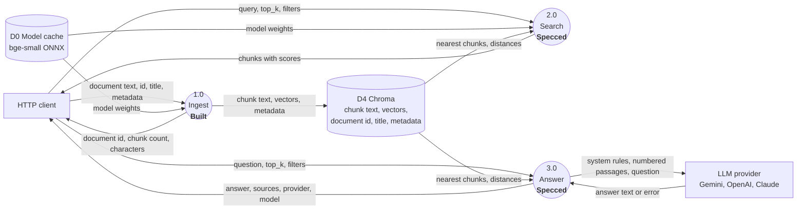
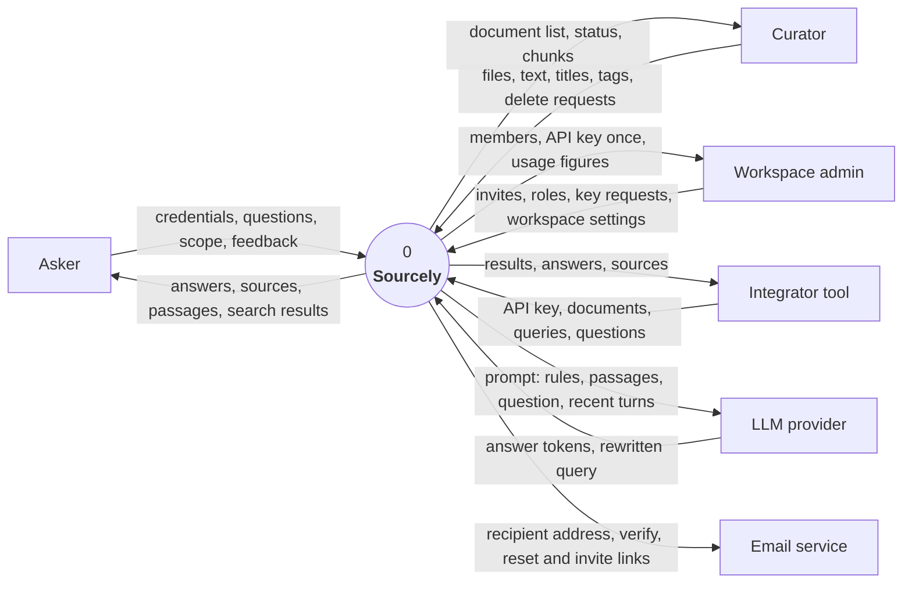
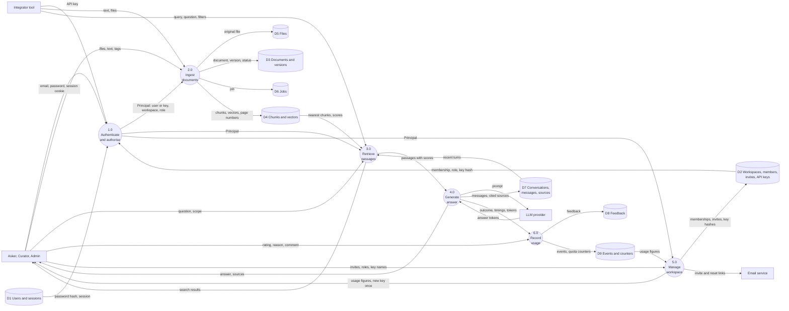
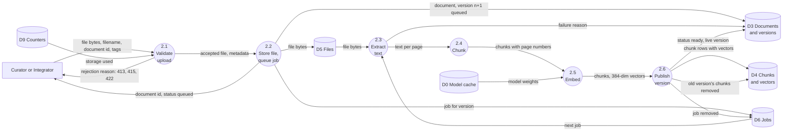
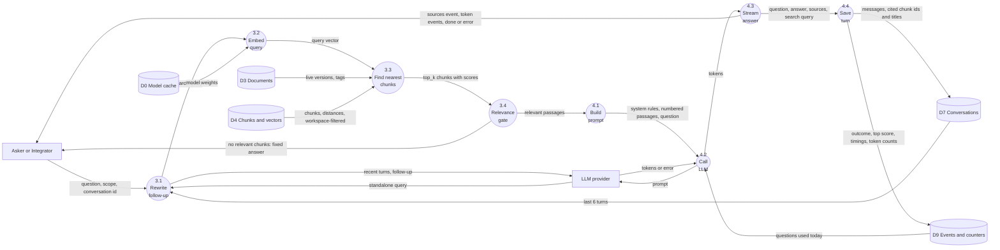
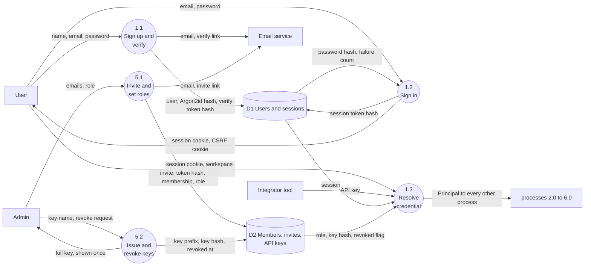
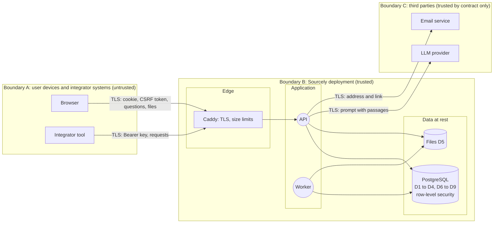
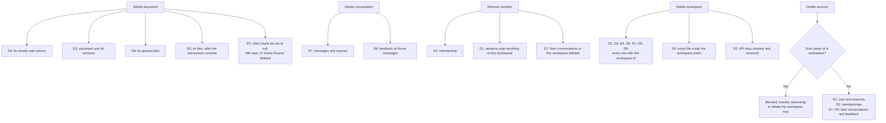

# Data flow diagrams: Sourcely

These diagrams show **what data moves where**: which parties and processes send which data, and which stores keep it. They complement the other documents:

- [`FLOW_DIAGRAMS.md`](FLOW_DIAGRAMS.md) shows the **order of calls** (sequence diagrams) and **status changes** (state machines).
- [`ARCHITECTURE.md`](ARCHITECTURE.md) shows the **components** and the **data model**.
- This document shows the **data**: its sources, its path, where it rests, and where it leaves the deployment.

Status labels are the same as everywhere: **Built**, **Specced**, **Proposed** (see [README](README.md#status-labels-used-everywhere)).

## Notation

The diagrams follow classic DFD notation (Gane and Sarson style), drawn in Mermaid.

| Shape | Meaning | Example |
|---|---|---|
| Rectangle | **External entity**: a person or system outside Sourcely that sends or receives data | Asker, LLM provider |
| Circle, numbered | **Process**: transforms data | 2.0 Ingest documents |
| Cylinder, `D1` to `D9` | **Data store**: data at rest | D4 Chunks and vectors |
| Labelled arrow | **Data flow**: the data that moves, named by its content | "question, scope" |
| Dashed box | **Trust boundary**: data crossing it needs authentication, validation or a privacy decision | Browser to server |

Every arrow is labelled with **data**, not actions. "Question text" is a data flow; "calls the API" is not.

## Contents

1. [Current PoC (Built and Specced)](#1-current-poc-built-and-specced)
2. [Level 0: context](#2-level-0-context)
3. [Level 1: main processes and stores](#3-level-1-main-processes-and-stores)
4. [Level 2: ingest documents](#4-level-2-ingest-documents)
5. [Level 2: answer a question](#5-level-2-answer-a-question)
6. [Level 2: authenticate and manage access](#6-level-2-authenticate-and-manage-access)
7. [Trust boundaries](#7-trust-boundaries)
8. [Data inventory](#8-data-inventory)
9. [Deletion flows](#9-deletion-flows)

---

## 1. Current PoC (Built and Specced)

The PoC has no users, no auth and no relational database. Everything a client sends is either stored as chunks in Chroma or used once and discarded. Only the question and retrieved passages ever leave the machine.

**What the PoC does not store:** questions, answers and request bodies. Logs hold the request id, method, path, status and duration, not the content.

## 2. Level 0: context

The whole product as one process. This view answers "what data enters and leaves Sourcely?"

**Two flows leave the deployment:** prompts to the LLM provider, and emails. Documents, files, vectors, conversations and usage data never leave it.

## 3. Level 1: main processes and stores

The product broken into its six processes and nine data stores. Every Level 2 diagram below expands one process from here.

| Process | Status | Expanded in |
|---|---|---|
| 1.0 Authenticate and authorise | Proposed | [Section 6](#6-level-2-authenticate-and-manage-access) |
| 2.0 Ingest documents | Built (JSON text), Specced (`.txt`, `.md` upload), Proposed (PDF, DOCX, worker) | [Section 4](#4-level-2-ingest-documents) |
| 3.0 Retrieve passages | Specced | [Section 5](#5-level-2-answer-a-question) |
| 4.0 Generate answer | Specced (single question), Proposed (conversations) | [Section 5](#5-level-2-answer-a-question) |
| 5.0 Manage workspace | Proposed | [Section 6](#6-level-2-authenticate-and-manage-access) |
| 6.0 Record usage | Proposed | [Section 8](#8-data-inventory) |

## 4. Level 2: ingest documents

Expands process 2.0. Sub-processes 2.1 and 2.2 run in the API. Sub-processes 2.3 to 2.6 run in the worker (Proposed, Phase 3). For JSON text, `POST /documents` runs 2.4 to 2.6 inside the request, which is the **Built** path.

**Data rules in this flow**

- The file is kept in D5 so a document can be re-processed when chunking or the embedding model changes, without asking the user to upload it again.
- 2.6 writes new chunks, moves the live version and deletes old chunks in **one transaction**. Readers see either the old version or the new one, never a mix.
- Extracted text is not stored separately from chunks. Chunks are the only copy of the document's text inside the database.

## 5. Level 2: answer a question

Expands processes 3.0 and 4.0. Steps 3.1 and 4.4 are Proposed (conversations, Phase 3). The rest follows `SPEC.md` for `/ask` and `/ask/stream`.

**Data rules in this flow**

- **Minimum data to the provider.** The LLM receives only the system rules, the passages that passed the relevance gate, the question and, for follow-ups, the last 6 turns. It never receives whole documents, other workspaces' data, user names, emails or tags.
- **The relevance gate stops data leaving.** When 3.4 finds nothing relevant, nothing is sent to the provider at all.
- **Sources are stored by reference.** D7 keeps the chunk id, document title, page and score, not a copy of the passage text. Deleting the document therefore removes the passage everywhere (see [section 9](#9-deletion-flows)).

## 6. Level 2: authenticate and manage access

Expands processes 1.0 and 5.0. All **Proposed** (Phase 1).

**Data rules in this flow**

- Secrets are stored only as hashes: passwords with Argon2id, and session tokens, verification tokens, invite tokens and API keys with SHA-256. A database leak exposes none of them in usable form.
- The full API key exists only in the response to 5.2 and in the integrator's own system.

## 7. Trust boundaries

The same system, grouped by where data is trusted. Every arrow that crosses a dashed boundary needs a control.

| Crossing | Data | Controls |
|---|---|---|
| A to B | Credentials, questions, files, document text | TLS. Authentication (FD-2). CSRF token for browser writes. Pydantic validation. Magic-byte file check, size limits. Rate limits. |
| B to A | Answers, passages, document lists, API key once | Workspace scoping on every read. `404` for other workspaces' resources. No stack traces. `HttpOnly` cookies. |
| Application to data | Every read and write | Required `workspace_id` in every repository call. PostgreSQL row-level security as the second check. App database role can't bypass RLS. |
| B to C, LLM | Rules, relevant passages, question, recent turns | Relevance gate sends nothing when no passage qualifies. Paid provider with no-training terms in production. Free-tier warning in development. Only these fields are sent. |
| B to C, email | Recipient address, one-time link | Links carry single-use tokens that expire. No document content in emails. |
| Worker to files | Uploaded files, which may be hostile | Extraction runs in the worker, not the API. Uncompressed-size limit. No macros run. External XML entities off. |

## 8. Data inventory

Every kind of data Sourcely holds, how sensitive it is, and how long it's kept.

| Data | Store | Sensitivity | Sent outside? | Kept until |
|---|---|---|---|---|
| Name, email | D1 | Personal data | Email service (address only) | Account deleted |
| Password | D1 | Secret | Never | Stored only as Argon2id hash. Replaced on reset. |
| Session and CSRF tokens | D1 | Secret | Never | 14 days idle, sign-out or password reset |
| Workspace name, memberships, roles | D2 | Internal | Never | Workspace deleted |
| Invite tokens | D2 | Secret | Email service (link) | Accepted or 7 days |
| API keys | D2 | Secret | Never after creation | Revoked. The row stays for audit, the hash is useless. |
| Document titles, tags, metadata | D3 | Customer confidential | Never. Titles are not sent to the LLM. | Document deleted |
| Original files | D5 | Customer confidential | Never | Document deleted |
| Chunk text and vectors | D4 | Customer confidential | Relevant passages only, to the LLM | Document deleted or version replaced |
| Jobs | D6 | Internal | Never | Job finished |
| Questions and answers | D7 | Customer confidential, may contain personal data | Question and recent turns, to the LLM | Conversation deleted by the user, or workspace deleted |
| Cited sources | D7 | Internal (references only) | Never | Conversation deleted. Chunk reference cleared when the document is deleted. |
| Feedback | D8 | Internal | Never | Conversation deleted |
| Events and counters | D9 | Internal, no content | Never | 13 months, then deleted |
| Access logs | Log files | Internal, no content | Log platform if one is added | 30 days |

**Rule for logs and events:** they hold ids, statuses, timings and counts. They never hold question text, answer text, document text or passwords. Unanswered questions shown in usage insights (F11) are read from D7, not from logs, so deleting a conversation removes them.

## 9. Deletion flows

What is removed, and from where, for each delete. Deletion is the flow most often forgotten in DFDs, and the one that proves the data inventory above is true.

**What a delete can't reach:** prompts already sent to the LLM provider. Their retention depends on the provider's terms, which is why production uses a provider with no-training and short-retention terms. This is stated in the admin settings screen and the README.
