# Flow diagrams: Sourcely

These diagrams show what happens **inside the system** for each operation: which component calls which, in what order, and where errors branch off. The user-facing side of the same operations is in [`INTERACTION_FLOWS.md`](INTERACTION_FLOWS.md). Components are described in [`ARCHITECTURE.md`](ARCHITECTURE.md).

Each diagram is labelled **Built**, **Specced** or **Proposed**. Specced diagrams follow `SPEC.md` exactly. Where a Proposed step extends a Specced flow, the step is marked in the diagram.

| ID | Flow | Status |
|---|---|---|
| [FD-1](#fd-1-rag-pipeline-overview) | RAG pipeline overview | Built (ingest half), Specced (query half) |
| [FD-2](#fd-2-request-pipeline-and-workspace-resolution) | Request pipeline and workspace resolution | Built (middleware), Proposed (auth) |
| [FD-3](#fd-3-ingest-json-text) | Ingest JSON text, `POST /documents` | **Built** |
| [FD-4](#fd-4-upload-a-file-with-background-processing) | Upload a file with background processing | Proposed |
| [FD-5](#fd-5-ingestion-worker-and-job-states) | Ingestion worker and job states | Proposed |
| [FD-6](#fd-6-semantic-search) | Semantic search, `POST /search` | Specced |
| [FD-7](#fd-7-ask) | Ask, `POST /ask` | Specced |
| [FD-8](#fd-8-streamed-ask-with-follow-up-rewriting) | Streamed ask with follow-up rewriting | Specced, rewriting Proposed |
| [FD-9](#fd-9-sign-up-verify-and-sign-in) | Sign up, verify and sign in | Proposed |
| [FD-10](#fd-10-api-key-authentication) | API key authentication | Proposed |
| [FD-11](#fd-11-delete-a-document) | Delete a document | Specced, cascade Proposed |
| [FD-12](#fd-12-accept-an-invite) | Accept an invite | Proposed |
| [FD-13](#fd-13-rate-limit-and-quota-check) | Rate limit and quota check | Proposed |

---

## FD-1. RAG pipeline overview

The two halves of retrieval-augmented generation. Both halves must use the **same embedding model**, or query vectors and chunk vectors aren't comparable.

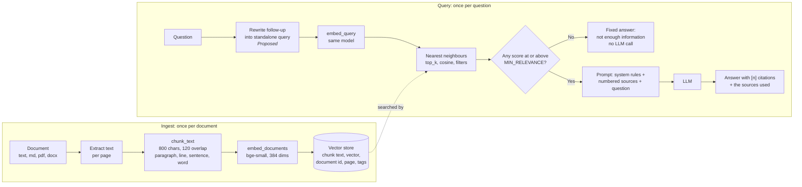

## FD-2. Request pipeline and workspace resolution

Every request passes through the same steps before a route runs. The middleware is **Built**. The auth step is **Proposed**.

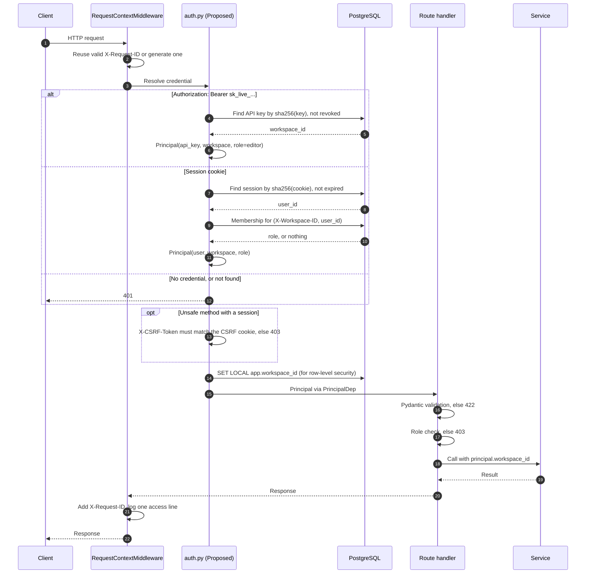

## FD-3. Ingest JSON text

`POST /documents`. **Built** (Task 3). Proposed additions for Phase 1 are only the auth step from FD-2 and the workspace id.

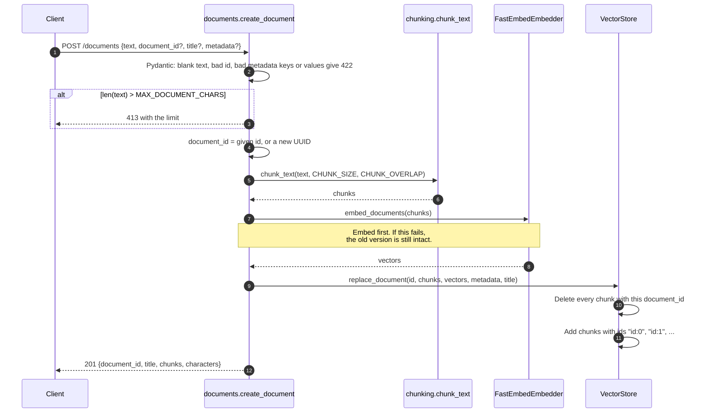

## FD-4. Upload a file with background processing

`POST /documents/upload` for all file types, returning `202` (decision D8). **Proposed** for Phase 3.

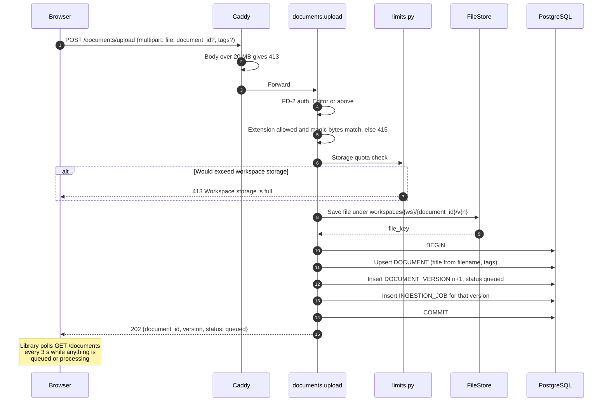

If saving the file succeeds but the transaction fails, the orphan file is removed by a daily cleanup that deletes files with no version row.

## FD-5. Ingestion worker and job states

**Proposed** for Phase 3. The worker is `python -m app.worker`, the same codebase as the API.

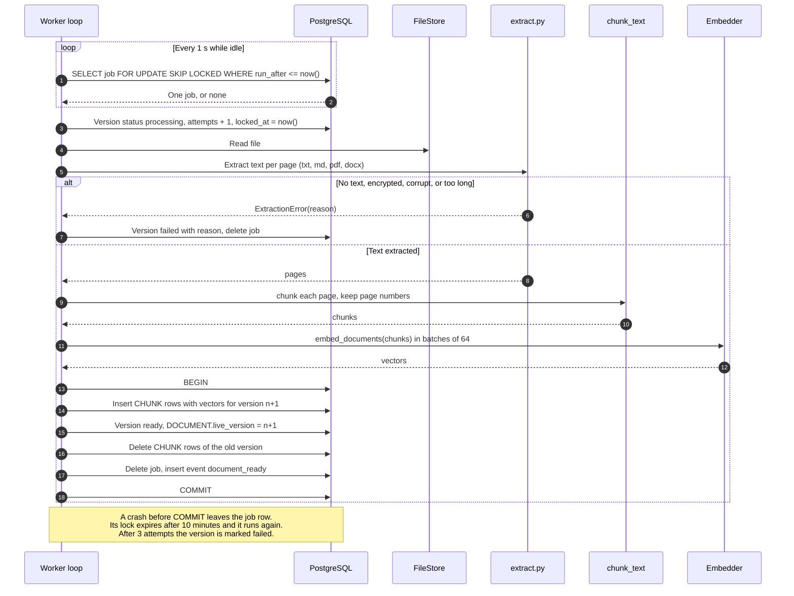

**Version status**

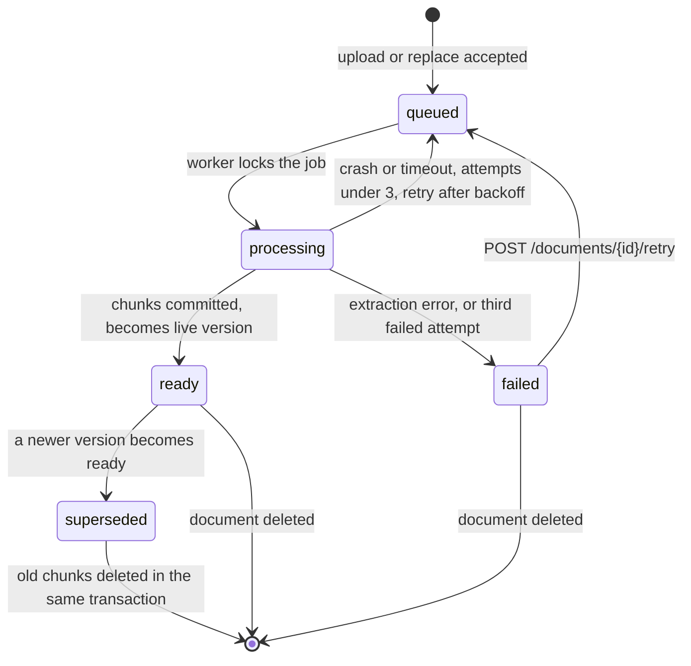

Backoff between attempts: 30 seconds, then 2 minutes.

## FD-6. Semantic search

`POST /search`. **Specced** (Task 4). The vector store is Chroma in the PoC and pgvector after D3. The route doesn't change.

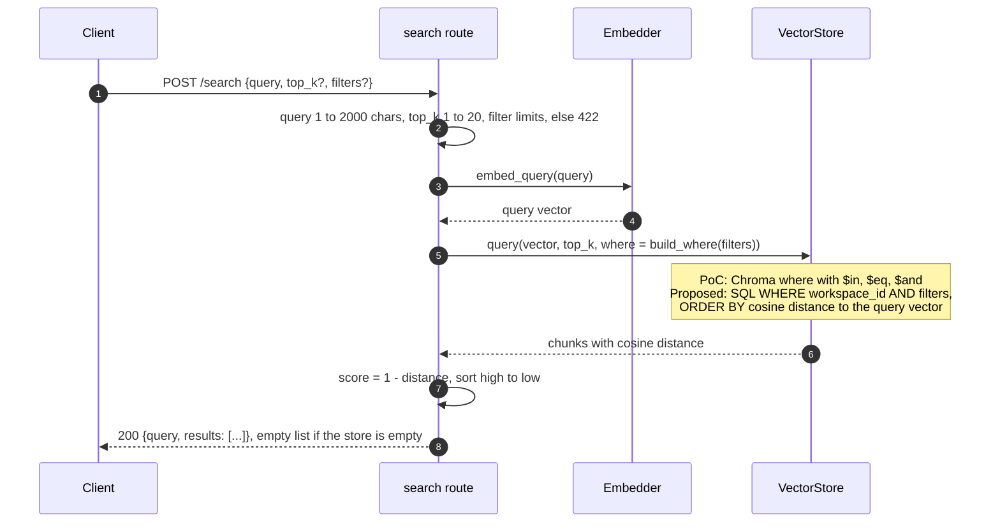

## FD-7. Ask

`POST /ask`. **Specced** (Task 5).

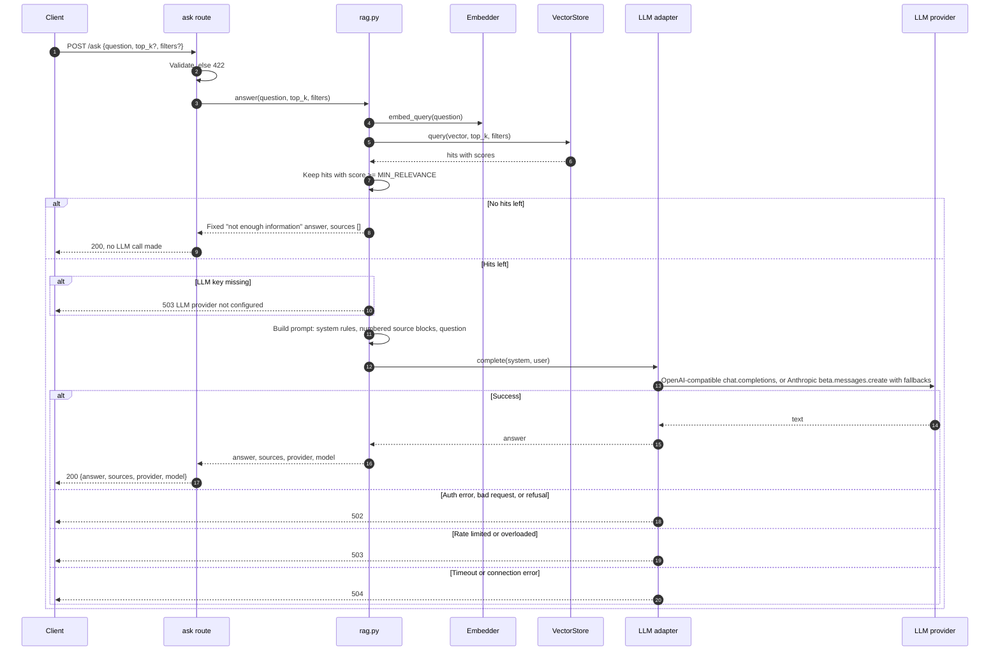

The adapter turns every SDK exception into one `LLMError(status_code, detail)`, so the route maps errors in one place.

## FD-8. Streamed ask with follow-up rewriting

`POST /ask/stream`. The stream protocol is **Specced** (Task 9). The conversation steps (load history, rewrite, save messages) are **Proposed** for Phase 3 and marked `(P)`.

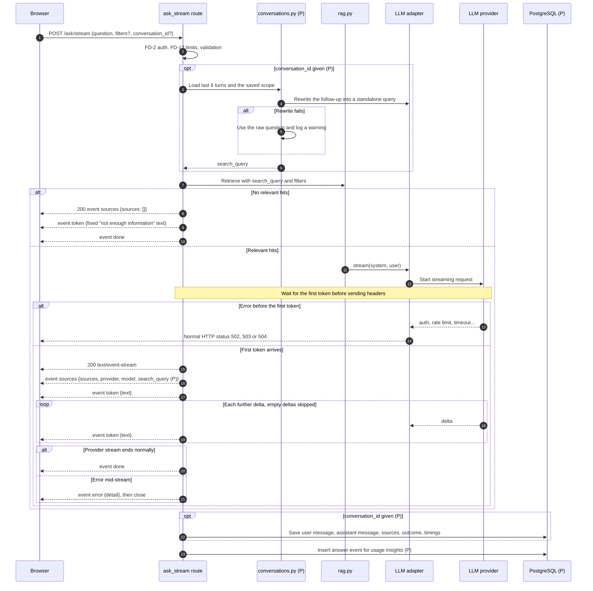

If the browser disconnects (the user pressed Stop), the generator stops pulling from the provider, which closes the provider connection. The partial answer is saved with outcome `stopped`.

## FD-9. Sign up, verify and sign in

**Proposed** for Phase 1.

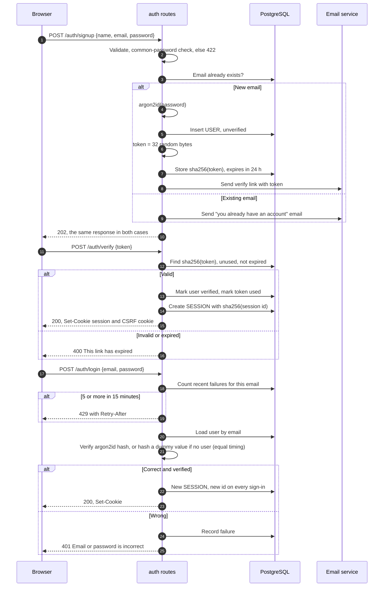

## FD-10. API key authentication

**Proposed** for Phase 1.

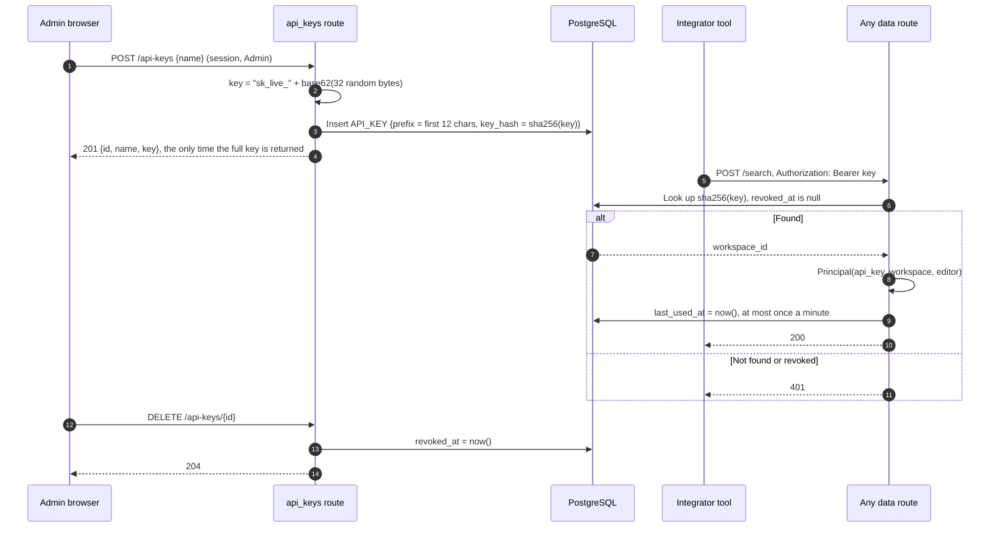

A plain SHA-256 hash is enough for API keys (unlike passwords), because the key is 32 random bytes and can't be guessed.

## FD-11. Delete a document

`DELETE /documents/{document_id}`. The PoC behaviour (204, or 404 when unknown) is **Specced** (Task 7). The cascade across versions, files and sources is **Proposed**.

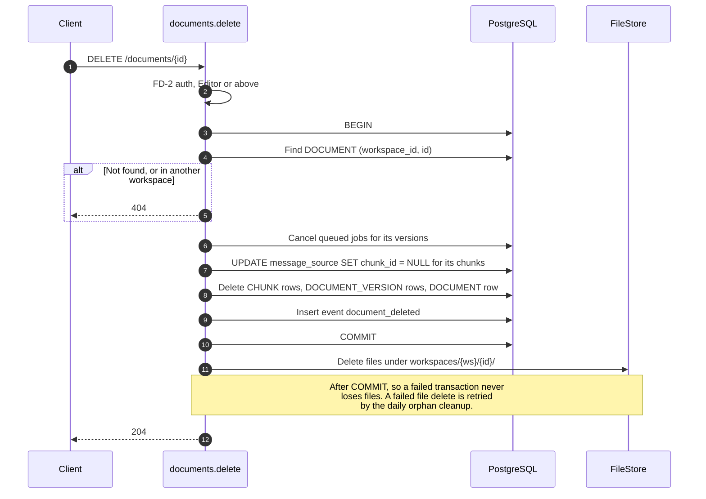

If the worker is processing a version of this document at the same moment, its final transaction finds the document gone and discards its chunks.

## FD-12. Accept an invite

**Proposed** for Phase 1 (API) and Phase 2 (UI).

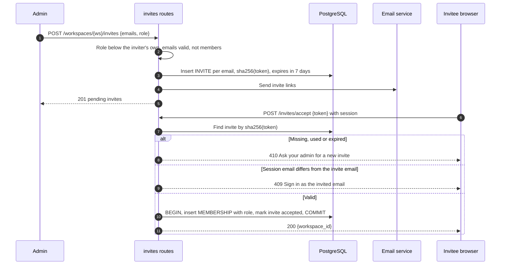

## FD-13. Rate limit and quota check

**Proposed** for Phase 4. Runs after auth, before the route's work.

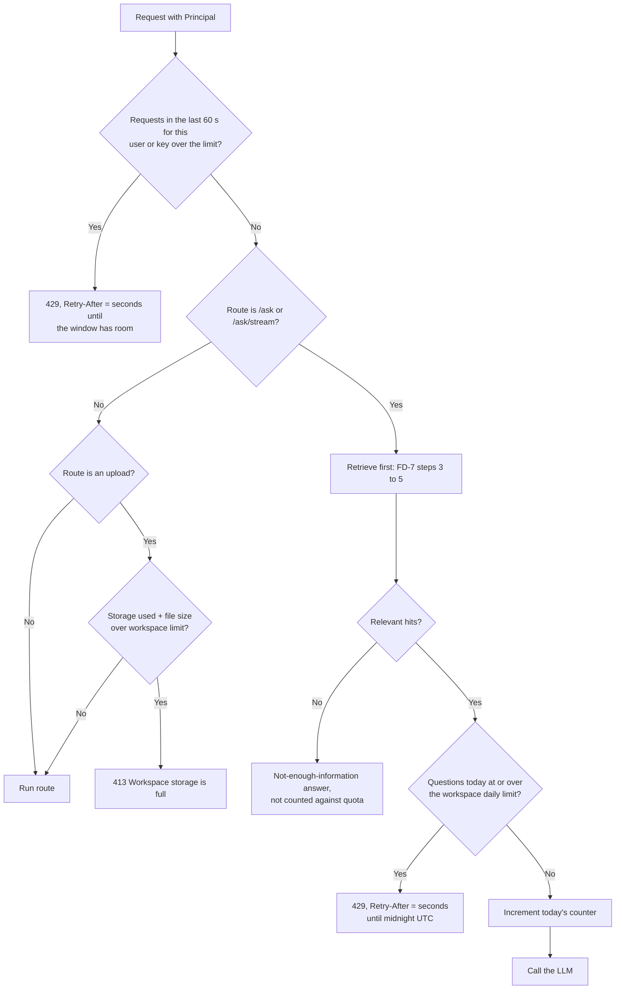

Counters live in a small Postgres table keyed by `(workspace_id, day)` for quotas, and a fixed-window counter per principal for rate limits. At pilot scale this avoids adding Redis (decision D5). If the API runs many copies with heavy traffic, the rate limiter moves to Redis.
