# Interaction flows: Sourcely

These flows show how a person moves through the screens in [`WIREFRAMES.md`](WIREFRAMES.md) to finish a job from the [PRD](PRD.md). They describe **user-visible steps and decisions**. What the server does at each step is in [`FLOW_DIAGRAMS.md`](FLOW_DIAGRAMS.md).

All flows are **Proposed**. The server behaviour under IF-4, IF-5 and IF-7 already exists or is specced in the PoC API.

| ID | Flow | Persona | Features |
|---|---|---|---|
| [IF-1](#if-1-first-run-sign-up-to-first-answer) | First run: sign up to first answer | Asker, Admin | F1, F2, F3, F4, F5 |
| [IF-2](#if-2-sign-in-and-password-reset) | Sign in and password reset | All | F1 |
| [IF-3](#if-3-upload-and-processing) | Upload and processing | Curator | F3, F4 |
| [IF-4](#if-4-ask-a-question) | Ask a question | Asker | F5, F9 |
| [IF-5](#if-5-follow-up-question) | Follow-up question | Asker | F6 |
| [IF-6](#if-6-scoped-question) | Scoped question | Asker | F7 |
| [IF-7](#if-7-replace-or-delete-a-document) | Replace or delete a document | Curator | F3 |
| [IF-8](#if-8-invite-a-teammate) | Invite a teammate | Admin | F2 |
| [IF-9](#if-9-create-and-use-an-api-key) | Create and use an API key | Admin, Integrator | F10 |
| [IF-10](#if-10-error-recovery-while-asking) | Error recovery while asking | Asker | F5, F12 |

---

## IF-1. First run: sign up to first answer

**Goal:** a new user gets a cited answer in under 5 minutes (PRD goal G2). This is the activation flow, so every step that can be skipped is skippable.

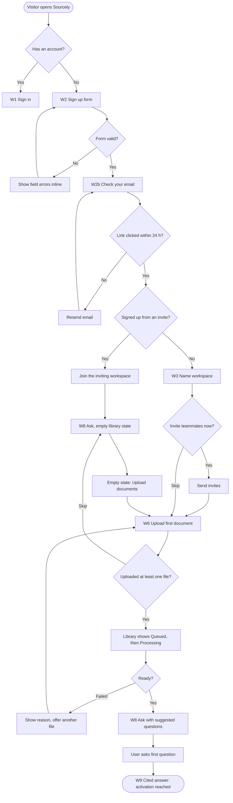

**Design notes**

- The user doesn't need to wait on the Library screen. Ask opens right away, and a toast says "‹title› is ready, ask about it" when processing ends.
- Invited users skip workspace creation and land in the team's workspace, where documents usually already exist.

## IF-2. Sign in and password reset

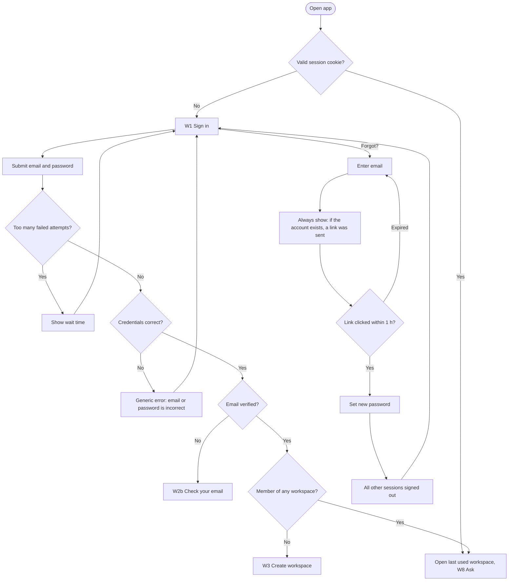

## IF-3. Upload and processing

**Goal:** a Curator adds documents without waiting and always knows each document's state.

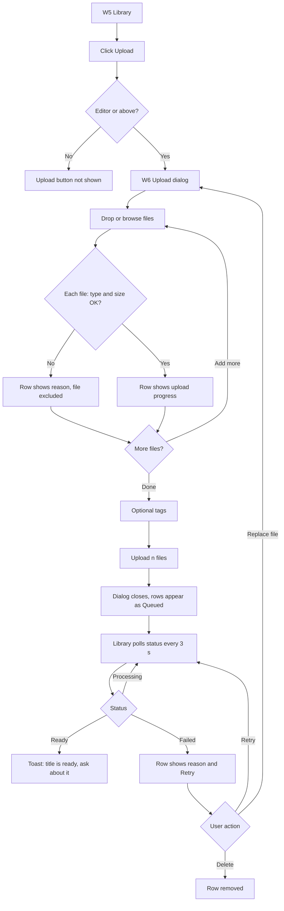

**Document status as the user sees it**

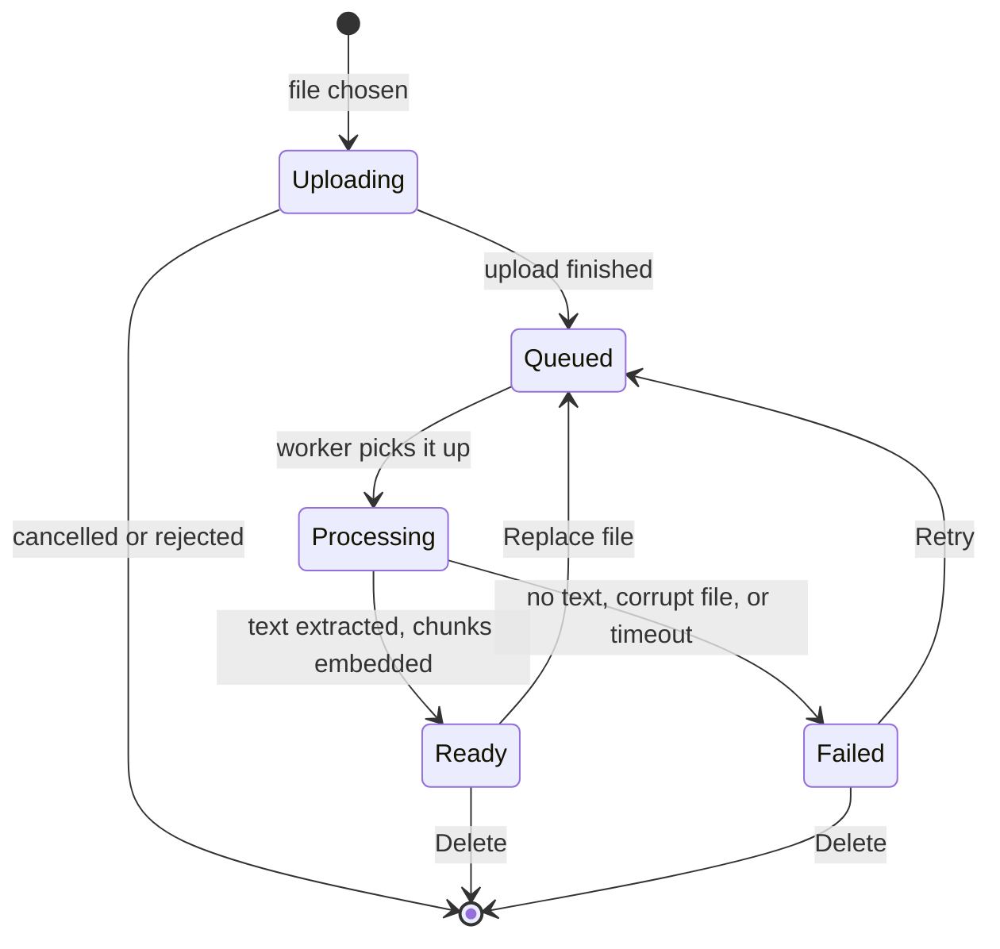

## IF-4. Ask a question

**Goal:** the Asker gets an answer they can trust, or a clear "not found".

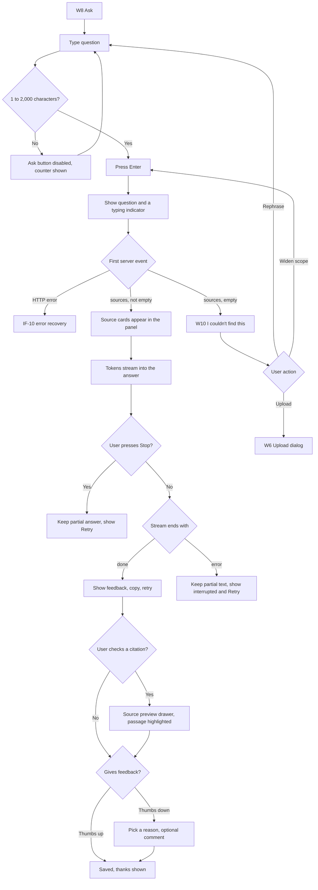

## IF-5. Follow-up question

**Goal:** short follow-ups work without the user repeating context.

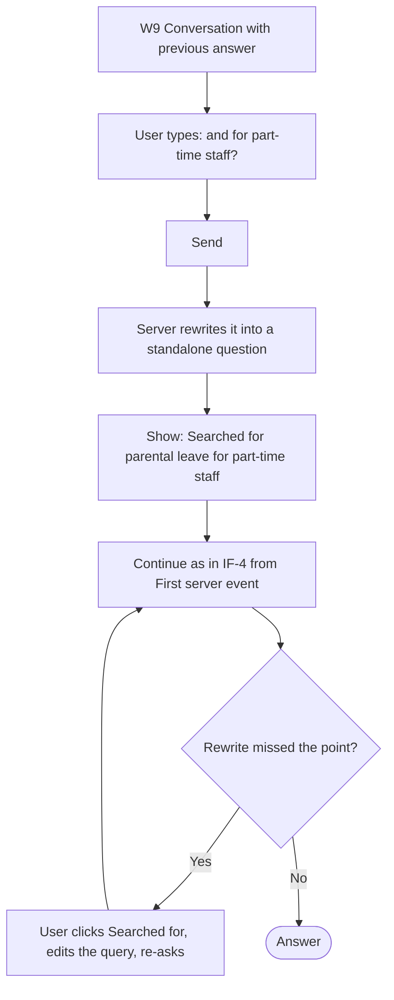

## IF-6. Scoped question

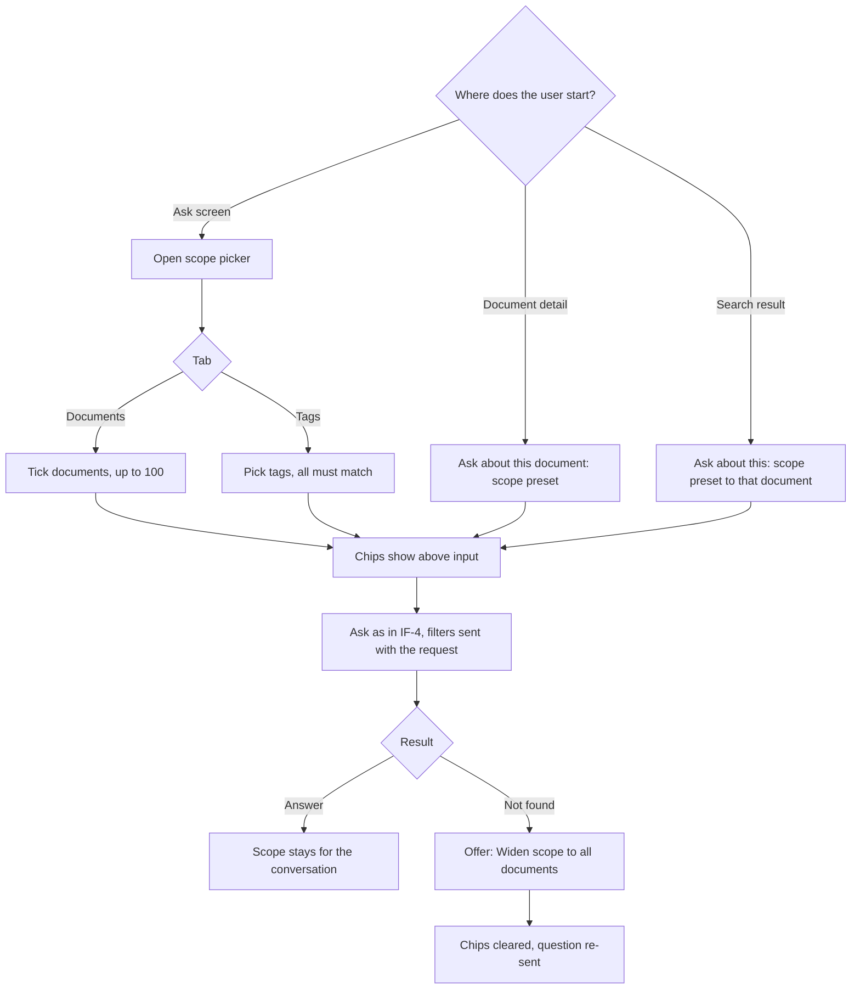

## IF-7. Replace or delete a document

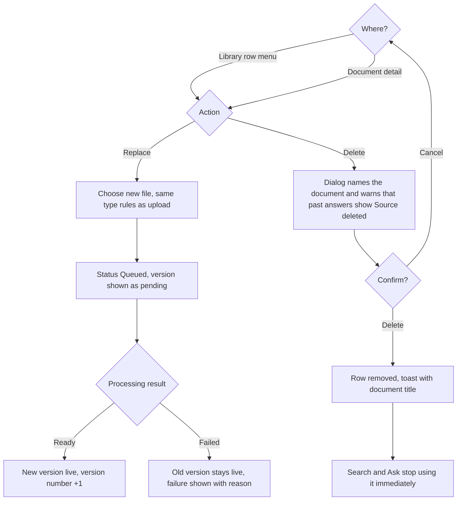

**Design note:** on replace, the old version stays searchable until the new version is Ready. A failed replace never leaves the document empty. This extends the PoC rule "embed before touching the store".

## IF-8. Invite a teammate

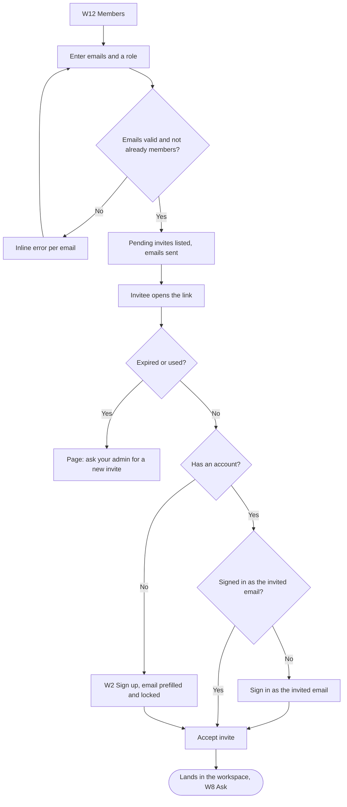

## IF-9. Create and use an API key

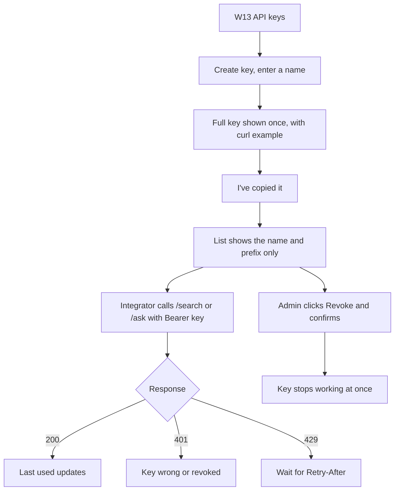

## IF-10. Error recovery while asking

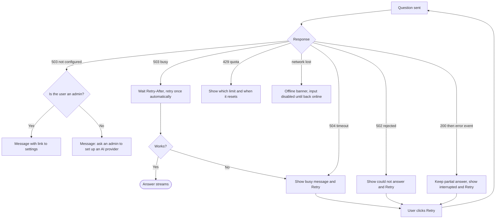

**Rules for every error**

- The question text is never lost. It stays in the conversation, and Retry re-sends it.
- Search and the Library keep working when the LLM fails, because they don't need it (SPEC rule: `/documents` and `/search` never need an LLM key).
- Every error message says what happened and what to do next, without technical detail. The request id is shown under "Details" for support.
