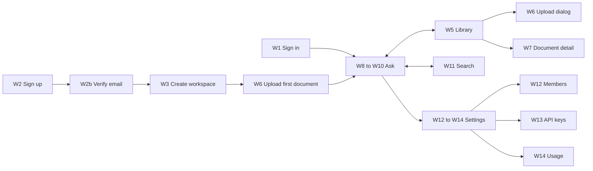

# Wireframes: Sourcely web app

Low-fidelity layouts for every screen in the [PRD](PRD.md). They fix **what is on each screen and where**, not colours or fonts. All screens are **Proposed** (Phase 2 unless noted).

How to read them:

- `[ Button ]` is a button, `[_____]` is a text input, `( )` and `(•)` are radio buttons, `[x]` is a checkbox, `▾` opens a menu.
- `‹…›` marks dynamic content. Numbers such as `①` point to the notes under each wireframe.
- Widths are desktop (about 1280 px). Mobile layouts are in [W15](#w15-mobile-ask).

## Screen map



---

## W1. Sign in

```
┌──────────────────────────────────────────────────────────────────────────────┐
│                                                                              │
│                              ◆ Sourcely                                      │
│                 Answers from your documents, with sources.                   │
│                                                                              │
│                  ┌────────────────────────────────────────┐                  │
│                  │  Sign in                               │                  │
│                  │                                        │                  │
│                  │  Email                                 │                  │
│                  │  [____________________________________]│                  │
│                  │  Password                  Forgot? ①   │                  │
│                  │  [____________________________________]│                  │
│                  │                                        │                  │
│                  │  ② ‹Email or password is incorrect.›   │                  │
│                  │                                        │                  │
│                  │  [            Sign in             ]    │                  │
│                  │                                        │                  │
│                  │  New to Sourcely?  Create an account   │                  │
│                  └────────────────────────────────────────┘                  │
└──────────────────────────────────────────────────────────────────────────────┘
```

1. "Forgot?" opens the reset form: one email field, and always the same confirmation ("If that email has an account, we sent a link"), so it never reveals which emails exist.
2. One generic error for a wrong email or a wrong password. After 5 failures in 15 minutes the message becomes "Too many attempts. Try again in ‹n› minutes."

## W2. Sign up and W2b. Verify email

```
┌─────────────────────────────────────┐    ┌─────────────────────────────────────┐
│  Create your account                │    │  Check your email                   │
│                                     │    │                                     │
│  Name                               │    │  ✉  We sent a link to               │
│  [_________________________________]│    │     ‹ayesha@example.com›            │
│  Work email                         │    │                                     │
│  [_________________________________]│    │  Click it to verify your email.     │
│  Password                           │    │  The link expires in 24 hours.      │
│  [_________________________________]│    │                                     │
│  ▓▓▓▓▓▓░░░░  ‹Strong enough› ①      │    │  [ Resend email ] ②                 │
│                                     │    │                                     │
│  [x] I agree to the terms           │    │  Wrong address? Go back             │
│                                     │    │                                     │
│  [       Create account       ]     │    │                                     │
└─────────────────────────────────────┘    └─────────────────────────────────────┘
```

1. Live strength meter. Rules: at least 12 characters and not on a common-password list. No composition rules.
2. "Resend" is disabled for 60 seconds after each send, with a countdown.

## W3. Create workspace (onboarding)

```
┌──────────────────────────────────────────────────────────────────────────────┐
│  ◆ Sourcely                                             Step 1 of 2  ●○      │
├──────────────────────────────────────────────────────────────────────────────┤
│                                                                              │
│      Name your workspace                                                     │
│      A workspace holds your team's documents. Only members can see it.       │
│                                                                              │
│      Workspace name                                                          │
│      [ Acme Support__________________________ ]                              │
│                                                                              │
│      Invite teammates (optional) ①                                           │
│      [ sara@acme.com, bilal@acme.com_________ ]   Role [ Editor ▾ ]          │
│                                                                              │
│                                               [ Skip ]  [ Continue → ]       │
└──────────────────────────────────────────────────────────────────────────────┘
```

1. Invites can wait until later. Step 2 is the upload dialog ([W6](#w6-upload-dialog)) with the hint "Start with one document your team asks about often."

## W4. App shell

Every signed-in screen uses this frame.

```
┌───────────────┬──────────────────────────────────────────────────────────────┐
│ ◆ Sourcely    │  ‹Page title›                                 ‹page actions› │
│               ├──────────────────────────────────────────────────────────────┤
│ [Acme Supp ▾]①│                                                              │
│               │                                                              │
│ ✎ New question│                     ‹page content›                           │
│               │                                                              │
│ ◉ Ask         │                                                              │
│ ▤ Library     │                                                              │
│ ⌕ Search      │                                                              │
│               │                                                              │
│ RECENT      ② │                                                              │
│  Parental le… │                                                              │
│  Refund rule… │                                                              │
│  VPN setup    │                                                              │
│               │                                                              │
│ ─────────────│                                                              │
│ ⚙ Settings  ③ │                                                              │
│ ● Ayesha   ▾  │                                                              │
└───────────────┴──────────────────────────────────────────────────────────────┘
```

1. Workspace switcher: lists the user's workspaces and "Create workspace". Switching reloads the page in the new workspace.
2. Recent conversations (Phase 3, F6). Before Phase 3 this area is hidden.
3. Settings is visible to everyone. Members, API keys and Usage appear inside it only for Owner and Admin.

## W5. Library

```
┌───────────────┬──────────────────────────────────────────────────────────────┐
│ (shell)       │  Library   ‹24 documents›                  [ ⤒ Upload ] ①    │
│               ├──────────────────────────────────────────────────────────────┤
│               │  [⌕ Filter by title______]  Tags [ All ▾ ]  Status [ All ▾ ] │
│               │                                                              │
│               │  TITLE                   TYPE  TAGS         CHUNKS  STATUS   │
│               │  ─────────────────────────────────────────────────────────── │
│               │  Leave policy 2026       PDF   hr policy       42  ● Ready   │
│               │  Refund process          MD    support          9  ● Ready   │
│               │  Onboarding handbook     DOCX  hr              —  ◐ Proc… ②  │
│               │  VPN setup guide         PDF   it               —  ○ Queued  │
│               │  Scanned contract        PDF   legal            —  ▲ Failed ③│
│               │  ...                                                         │
│               │                                     ‹ 1  2  3 ›  25 per page │
└───────────────┴──────────────────────────────────────────────────────────────┘
```

1. Upload is hidden for Viewers.
2. The status updates live (polling every 3 seconds while any row is Queued or Processing).
3. A Failed row shows its reason on hover and a "Retry" action in the row menu `⋯`.

Row menu `⋯` (Editor and above): Open, Edit tags, Replace file, Delete.

**Empty state:**

```
│               │                  ▤                                           │
│               │        No documents yet                                      │
│               │   Upload policies, guides or notes. Sourcely answers         │
│               │   questions from them and shows where each answer came from. │
│               │                  [ ⤒ Upload documents ]                      │
```

## W6. Upload dialog

```
┌────────────────────────────────────────────────────────────┐
│  Upload documents                                       ✕  │
├────────────────────────────────────────────────────────────┤
│  ┌──────────────────────────────────────────────────────┐  │
│  │                        ⤒                             │  │
│  │      Drag files here, or  [ Browse ]                 │  │
│  │      .pdf .docx .md .txt · up to 20 MB each ①        │  │
│  └──────────────────────────────────────────────────────┘  │
│                                                            │
│  leave-policy-2026.pdf     2.1 MB   ▓▓▓▓▓▓▓▓▓░  90%        │
│  refund-process.md         8 KB     ✓ Uploaded             │
│  photo.jpg                 1.2 MB   ✕ File type not        │
│                                       supported ②          │
│                                                            │
│  Tags for these files (optional)                           │
│  [ hr × ] [ policy × ] [ add tag___ ]  ③                   │
│                                                            │
│                            [ Cancel ]  [ Upload 2 files ]  │
└────────────────────────────────────────────────────────────┘
```

1. Before Phase 3 the hint reads ".md .txt" only.
2. Invalid files are rejected in the browser with the reason, and the server checks again.
3. Tag rules come from the PoC metadata rules: lowercase letters, digits, `-` and `_`, up to 32 characters, at most 10 tags per document.

After upload the dialog closes and the Library shows the new rows as **Queued**. The upload never waits for processing.

## W7. Document detail

```
┌───────────────┬──────────────────────────────────────────────────────────────┐
│ (shell)       │  ← Library / Leave policy 2026      [ Replace ] [ Delete ] ① │
│               ├──────────────────────────────────────────────────────────────┤
│               │  ● Ready · PDF · 14 pages · 42 chunks · 2.1 MB               │
│               │  Added by Sara · 12 Sep 2026 · Version 2 ②                   │
│               │  Tags  [ hr × ] [ policy × ] [ + ]                           │
│               │  ID    leave-policy-2026   ⧉ ③                               │
│               │                                                              │
│               │  [ Ask about this document ] ④                               │
│               │                                                              │
│               │  CHUNKS                                         Page [ All ▾]│
│               │  ─────────────────────────────────────────────────────────── │
│               │  #0 · p.1   "Leave Policy 2026. This policy applies to all   │
│               │              employees, including part-time staff…"          │
│               │  #1 · p.1   "…Annual leave accrues at 1.75 days per month…"  │
│               │  #2 · p.2   "Parental leave. Birth parents are entitled…"    │
│               │  ...                                                         │
└───────────────┴──────────────────────────────────────────────────────────────┘
```

1. Replace and Delete are hidden for Viewers. Delete opens a confirmation dialog that names the document and says "Answers that cited it will show 'Source deleted'."
2. The version increases on every replace.
3. Copies the document id for API use.
4. Opens Ask with the scope set to this document (F7).

## W8. Ask: new question

```
┌───────────────┬──────────────────────────────────────────────────────────────┐
│ (shell)       │  Ask                                                         │
│               ├──────────────────────────────────────────────────────────────┤
│               │                                                              │
│               │                 What do you want to know?                    │
│               │        Answers come only from Acme Support's 24 documents.   │
│               │                                                              │
│               │   Try:  "How many days of annual leave do I get?"  ①         │
│               │         "What's the refund window for annual plans?"         │
│               │                                                              │
│               │  ┌────────────────────────────────────────────────────────┐  │
│               │  │ Scope: All documents ▾  ②                              │  │
│               │  │ [Ask a question about your documents…_______________]  │  │
│               │  │                                         [ Ask ↵ ]      │  │
│               │  └────────────────────────────────────────────────────────┘  │
└───────────────┴──────────────────────────────────────────────────────────────┘
```

1. Suggested questions come from the titles of the most-cited documents. They are hidden when the library is empty. Then the page shows the Library empty state's upload button instead.
2. The scope picker (F7) opens a panel with two tabs: **Documents** (searchable checklist) and **Tags**. Chosen items show as chips: `Scope: [hr ×] [Leave policy 2026 ×]`.

`Enter` sends. `Shift+Enter` adds a new line. The question is limited to 2,000 characters, and a counter appears after 1,800.

## W9. Ask: streaming answer with sources

```
┌───────────────┬──────────────────────────────────────────────────────────────┐
│ (shell)       │  Parental leave for part-time staff              [ ⋯ ]  ①    │
│               ├───────────────────────────────────────┬──────────────────────┤
│               │                                       │ SOURCES (3)       ④  │
│               │  ● You                                │                      │
│               │  Do part-time staff get parental      │ [1] Leave policy 2026│
│               │  leave?                               │     p.2 · 0.82 ▓▓▓▓░ │
│               │                                       │     "Parental leave. │
│               │  ◆ Sourcely                           │     Birth parents …" │
│               │  Yes. Part-time staff get parental    │                      │
│               │  leave on the same terms as full-time │ [2] Leave policy 2026│
│               │  staff [1]. The paid portion is       │     p.3 · 0.77 ▓▓▓░░ │
│               │  pro-rated to contracted hours [2],   │                      │
│               │  and it must be requested 8 weeks in  │ [3] HR FAQ           │
│               │  advance [3]▍ ②                       │     p.1 · 0.71 ▓▓▓░░ │
│               │                                       │                      │
│               │  [ ■ Stop ]                           │                      │
│               │                                       │                      │
│               │  ── after completion ──               │                      │
│               │  [ 👍 ] [ 👎 ] [ ⧉ Copy ] [ ↻ Retry ] ③│                      │
│               │  Searched for: parental leave for     │                      │
│               │  part-time staff ⑤                    │                      │
│               ├───────────────────────────────────────┴──────────────────────┤
│               │ Scope: All documents ▾                                       │
│               │ [Ask a follow-up…_______________________________] [ Ask ↵ ]  │
└───────────────┴──────────────────────────────────────────────────────────────┘
```

1. Conversation menu: Rename, Delete (Phase 3, F6).
2. The cursor `▍` shows the answer is still streaming. Sources appear **before** the first word, because the API sends the `sources` event first.
3. Feedback, copy and retry appear when the `done` event arrives. Thumbs down opens a reason picker (F9).
4. Hovering `[2]` in the text highlights source card 2, and clicking it opens the **source preview** drawer: the full chunk with the cited passage highlighted, the page number, and "Open document".
5. Shown only for follow-up questions that were rewritten (F6).

## W10. Ask: no answer, and error states

**Not enough information** (no chunk met `MIN_RELEVANCE`, so the LLM was not called):

```
│  ◆ Sourcely                                                                  │
│  ┌────────────────────────────────────────────────────────────────────────┐  │
│  │ ⓘ  I couldn't find this in your documents.                            │  │
│  │    Try different words, widen the scope, or upload a document that     │  │
│  │    covers it.                                                          │  │
│  │    [ Widen scope to all documents ]  [ ⤒ Upload ]  ①                   │  │
│  └────────────────────────────────────────────────────────────────────────┘  │
```

1. "Widen scope" appears only when a scope was set. "Upload" appears only for Editors and above.

**Errors** (the HTTP status comes from the SPEC error table):

| Situation | Status | Message in the answer area | Action |
|---|---|---|---|
| LLM not configured | 503 | "Answers are turned off for this workspace. An admin needs to set up an AI provider." | Admins get a link to settings |
| Provider rate limit or overload | 503 | "The AI service is busy. Try again in a moment." | `[ Retry ]`, auto-retry once after `Retry-After` |
| Workspace quota reached | 429 | "Your workspace reached its daily question limit. It resets at ‹time›." | None |
| Timeout or no connection | 504 | "The AI service didn't respond in time." | `[ Retry ]` |
| Provider rejected the request | 502 | "The AI service couldn't answer this question." | `[ Retry ]` |
| Stream broke after starting | `error` event | Partial answer stays, with "The answer was interrupted." | `[ Retry ]` |
| Offline | none | Banner: "You're offline. Questions will work when you reconnect." | Input disabled |

## W11. Search

```
┌───────────────┬──────────────────────────────────────────────────────────────┐
│ (shell)       │  Search                                                      │
│               ├──────────────────────────────────────────────────────────────┤
│               │  [⌕ refund window annual plan_____________]  Scope [ All ▾ ] │
│               │  Results  [ 4 ▾ ] ①                                          │
│               │                                                              │
│               │  Refund process · p.1                      0.84 ▓▓▓▓░  ②     │
│               │  "…annual plans can be refunded in full within 30 days of    │
│               │  purchase. After 30 days, refunds are pro-rated…"            │
│               │  [ Open ]  [ Ask about this ]                                │
│               │  ─────────────────────────────────────────────────────────── │
│               │  Billing FAQ · p.2                         0.73 ▓▓▓░░        │
│               │  "…monthly plans are not refundable…"                        │
│               │  ...                                                         │
└───────────────┴──────────────────────────────────────────────────────────────┘
```

1. The PoC `top_k`, limited to 1 to 20.
2. The score is the cosine similarity from `/search`. The bar makes it readable for non-technical users, and the number is there for curators.

## W12. Settings: Members (Owner and Admin)

```
┌───────────────┬──────────────────────────────────────────────────────────────┐
│ (shell)       │  Settings                                                    │
│               │  [ General ] [ Members ] [ API keys ] [ Usage ]               │
│               ├──────────────────────────────────────────────────────────────┤
│               │  Invite people                                               │
│               │  [ email@company.com, …__________ ]  [ Editor ▾ ] [ Invite ] │
│               │                                                              │
│               │  MEMBER                       ROLE          LAST ACTIVE      │
│               │  ─────────────────────────────────────────────────────────── │
│               │  Ayesha (you)  ayesha@…       Owner          now             │
│               │  Sara          sara@…         [ Admin  ▾ ]   2 h ago     ⋯   │
│               │  Bilal         bilal@…        [ Editor ▾ ]   3 d ago     ⋯   │
│               │                                                              │
│               │  PENDING INVITES                                             │
│               │  zain@acme.com  Viewer  expires in 6 days  [ Resend ] [ ✕ ]  │
└───────────────┴──────────────────────────────────────────────────────────────┘
```

Role menus only offer roles below the current user's own role. Row menu `⋯`: Remove from workspace (with confirmation). The General tab holds the workspace name and, for the Owner only, "Transfer ownership" and "Delete workspace" (type the name to confirm).

## W13. Settings: API keys (Owner and Admin)

```
│  API keys                                              [ + Create key ]      │
│  Keys act on this workspace with Editor access. ①                            │
│                                                                              │
│  NAME            KEY              CREATED        LAST USED    ⋯              │
│  Helpdesk bot    sk_live_7Hq2…    1 Sep 2026     5 min ago    [ Revoke ]     │
│  Intranet        sk_live_Pz9x…    20 Aug 2026    never        [ Revoke ]     │
```

**Key created (shown once):**

```
┌────────────────────────────────────────────────────────────┐
│  Copy your new key                                         │
│  You won't see it again. Store it somewhere safe.          │
│  [ sk_live_7Hq2mR…full key…c9Tz ]  [ ⧉ Copy ]              │
│                                                            │
│  curl -H "Authorization: Bearer ‹key›" \                   │
│       https://‹host›/search -d '{"query":"…"}'  ②          │
│                                        [ I've copied it ]  │
└────────────────────────────────────────────────────────────┘
```

1. Links to the API docs at `/docs`.
2. A ready-to-run example lowers the integration effort.

## W14. Settings: Usage (Owner and Admin, Phase 4)

```
│  Usage        Period [ Last 30 days ▾ ]                                      │
│                                                                              │
│  ┌──────────────┐ ┌──────────────┐ ┌──────────────┐ ┌──────────────┐         │
│  │ Questions    │ │ Active askers│ │ Helpful      │ │ No answer    │         │
│  │   1,284      │ │     18       │ │   81 %       │ │   12 %       │         │
│  │  ▲ 22%       │ │  ▲ 3         │ │  ▲ 4 pts     │ │  ▼ 3 pts     │         │
│  └──────────────┘ └──────────────┘ └──────────────┘ └──────────────┘         │
│                                                                              │
│  Questions per day                                                           │
│  ▁▂▂▃▅▄▆▅▇▆▇█▇▆▇█▇▇█  ①                                                       │
│                                                                              │
│  UNANSWERED QUESTIONS ②              MOST CITED DOCUMENTS                    │
│  "Do we cover dental?"   ×7          Leave policy 2026      312              │
│  "Expense limit abroad"  ×4          Refund process         201              │
│                                                                              │
│  LIMITS   Questions today 212 / 1,000 · Storage 180 MB / 1 GB ③              │
```

1. Hovering a day shows its exact counts.
2. Questions that got "not enough information", grouped by similar wording. This is the curators' to-do list.
3. Quota use (F12).

## W15. Mobile Ask

```
┌──────────────────────────┐
│ ☰  Ask            [ ✎ ]  │ ① menu opens the shell as a drawer
├──────────────────────────┤
│ ● You                    │
│ Do part-time staff get   │
│ parental leave?          │
│                          │
│ ◆ Sourcely               │
│ Yes. Part-time staff get │
│ parental leave on the    │
│ same terms [1]. The paid │
│ portion is pro-rated [2].│
│                          │
│ [1] Leave policy · p.2 › │ ② sources stack under the answer
│ [2] Leave policy · p.3 › │
│ 👍 👎 ⧉                   │
├──────────────────────────┤
│ [Ask a follow-up…] [ ↵ ] │
└──────────────────────────┘
```

1. Below 768 px the sidebar becomes a drawer and the sources panel moves under the answer.
2. Tapping a source opens the preview as a bottom sheet.

---

## Accessibility requirements for all screens

- Every action works with the keyboard alone, with a visible focus ring.
- Streaming text is in an `aria-live="polite"` region that announces the finished answer once, not every token.
- Citation markers are links with labels such as "Source 1: Leave policy 2026, page 2".
- Statuses use icon plus text, never colour alone. Text contrast is at least 4.5 to 1 (WCAG 2.2 AA).
- Relevance bars have the number next to them for screen readers.
